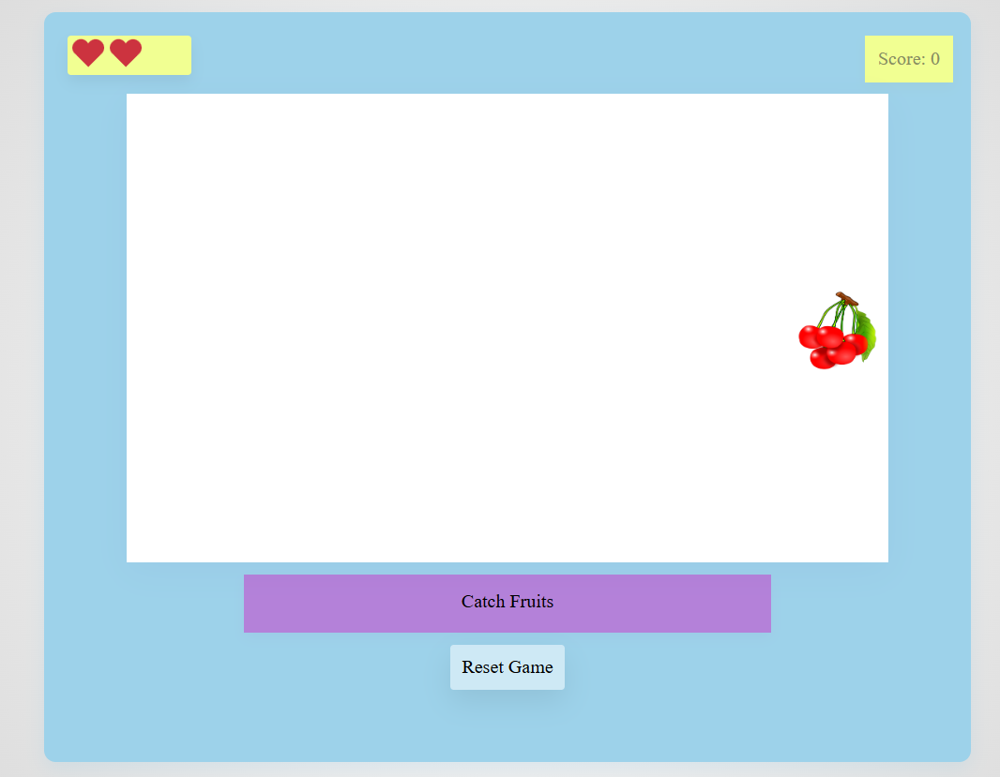

# 🍉 Fruit Slice Game (jQuery)

A simple browser-based **Fruit Slice Game** built with **HTML, CSS, and jQuery**.  
Slice fruits, earn points, and try not to miss too many!.

---

## 🎮 Features
✅ Slice fruits with your mouse (hover).  
✅ Randomly generated fruits.  
✅ Score counter with live updates.  
✅ 3 lives system (hearts).  
✅ Game over screen with your final score.  
✅ Reset/Restart functionality.  
✅ Sound effects when slicing fruits.  

---

## 🖼️ Screenshot


---

## 🛠️ Tech Stack
- **HTML5**
- **CSS3**
- **jQuery**
- **jQuery UI** (explode effect for slicing)

---

## 🎯 How to Play

- Click Start Game.
- Slice the falling fruits by moving your mouse over them.
- Earn points for each fruit sliced.
- Don’t miss! You only have 3 lives.
- Game ends when lives are gone. See your final score!

## 🚀 Future Improvements
- Add more fruit types and fun power-ups 🍓🍍
- Mobile-friendly controls (touch gestures for slicing)
- High-score leaderboard with localStorage or backend
- Difficulty levels (easy, medium, hard)
- Background music and more sound effects
- Animated splash screen and better UI styling

## 🙏 Acknowledgments
- Built with **jQuery** and **jQuery UI**
- Icons and fruit images from [Openclipart.org](https://openclipart.org/)
- Sound effects from [freesound.org](https://freesound.org)

## 📂 Project Structure
For a detailed project structure, see [structure.txt](structure.txt).


## 🚀 Getting Started

### Clone the repository
```bash
git clone https://github.com/your-username/fruit-slice-game.git
cd fruit-slice-game
